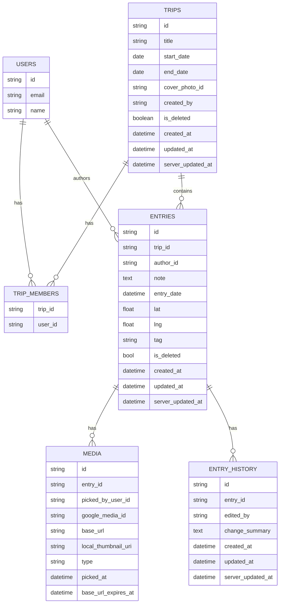
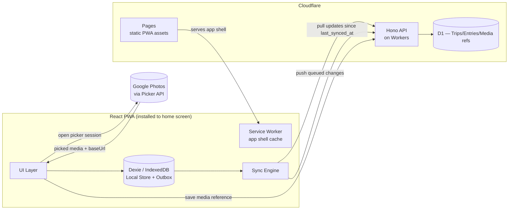
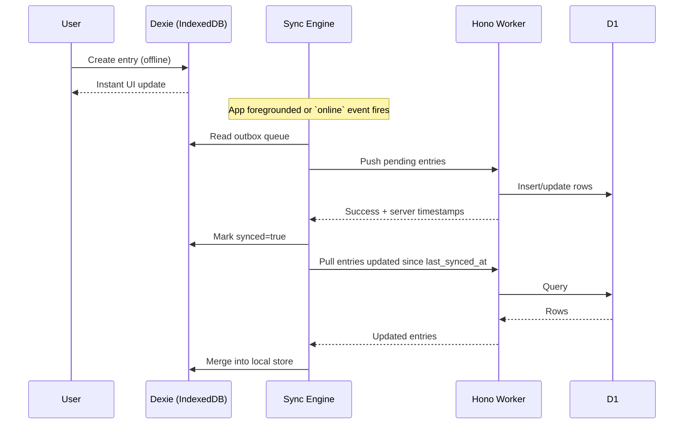

# Travel Journal

## 1. Overview

A shared travel logging app for two users. Built as a React PWA (frontend) for offline support and Hono on Cloudflare Workers (backend).

## 2. Tech Stack Decisions

| Layer | Choice | Rationale |
|---|---|---|
| Frontend | React + TypeScript PWA (Vite) | Leverages existing React/TS experience; one codebase for iPhone and Android; updates ship by deploying |
| Routing | TanStack Router | File-based routing, less boilerplate |
| PWA tooling | vite-plugin-pwa (Workbox) | Service worker precaches the app shell so the app loads fully offline; handles update prompts
| Server state | TanStack Query | Defacto state management for server queries and mutaions |
| Local storage | Dexie (IndexedDB) | Structured local store needed for offline queue + entry cache; typed tables, simple API. Small suite of React hooks to make accessing data easy |
| Maps | MapLibre GL JS | Open source map library, some familiarity and straightforward enough api
| Frontend hosting | Cloudflare Workers | Low latency, generous free tier, same hosting as backend
| Backend framework | Hono | Lightweight, first-class Cloudflare Workers support, typed RPC client (`hc`) gives end-to-end type safety without codegen (although probably won't end up using it) |
| Backend hosting | Cloudflare Workers | Low latency, generous free tier, pairs naturally with D1/R2, same hosting as frontend |
| Relational data | Cloudflare D1 (SQLite) | Trips/entries/users are relational; D1 fits with Workers natively |
| Media storage | Google Photos (via Picker API) | Existing albums already live there; avoids duplicating storage/sync pipeline and potential storage costs |
| Auth | better-auth, Google OAuth, cookie sessions, sign-up disabled | Google OAuth via better-auth's social provider avoids managing passwords; sign-up is disabled so only the two pre-seeded accounts can access |

## 3. Data Model

One trip, shared by both users via `trip_members`. Entries carry `author_id` for attribution, but all reads are scoped to `trip_id`.

On the client, these map to Dexie tables mirroring the server shape, plus an `outbox` table.

## 4. System Architecture

## 5. Offline-First Sync Design

This is the trickiest part of the build and is designed deliberately rather than retrofitted:

1. **Local-first writes**; every entry is created immediately in Dexie with a client-generated UUID. The UI never blocks on network.
2. **App shell offline**; the service worker pre-caches the app shell so the app opens with no connection.
3. **Sync queue (outbox)**; a Dexie table of pending creates/updates/photo references. There is no Background Sync API on iOS, so the sync engine runs while the app is open: on load, on `visibilitychange`, and on the `online` event. It walks the queue and pushes to the API. Nothing syncs while the app is closed.
4. **Conflict resolution**; last-write-wins by `updated_at`. With only two authors on one trip, simultaneous edits to the same entry are rare enough that CRDTs (Conflict-free replicated data type) are unnecessary complexity.
5. **Storage durability**; installing the PWA to the home screen exempts it from Safari's storage eviction for unused sites. The app also requests persistent storage via `navigator.storage.persist()`.
6. **Photos**; attached via the Google Photos Picker API rather than uploaded to app-owned storage. Since users have separate Google accounts, each authorizes the Picker individually with their own OAuth token - `picked_by_user_id` on the `media` row tracks whose library a photo came from. Google auth uses the authorization code flow through the Worker, which holds the refresh token. Picking requires an active connection and can happen at any time (not just entry creation/edit). Once picked, a small thumbnail is fetched (with the OAuth token) and stored as a blob in IndexedDB so it remains viewable offline afterward; only the *picking* action itself requires connectivity. Entries with no cached thumbnail yet show a placeholder tile with an offline indicator. `base_url` values from Google expire, so the full-resolution image is re-fetched on view rather than cached long-term — only the thumbnail is kept locally.
7. **Pull sync** — on reconnect/foreground, fetch entries where `updated_at > last_synced_at` for the trip and merge into the local store.

## 6. V1 Features Beyond Core Logging

- **Tags/categories**; each entry carries a `tag` (food/sight/activity/accommodation, etc.). Feeds both search and stats.
- **Search/filter within a trip**; filter entries by date, tag, or keyword match against `note`. Straightforward query against local database (and D1 server-side) once tags exist.
- **Trip stats/summary**; computed from existing entry data: days traveled (from `start_date`/`end_date`), locations visited, entry counts by tag.
- **Map view**; pins for each entry plotted using existing `lat`/`lng`.
- **Entry edit/delete history**; since past trips remain always-editable, changes are tracked via an `entry_history` table (who edited, when, summary of the change) rather than silent overwrites. Deletes are soft (`is_deleted` flag) rather than destructive, so history stays intact and entries remain recoverable.
